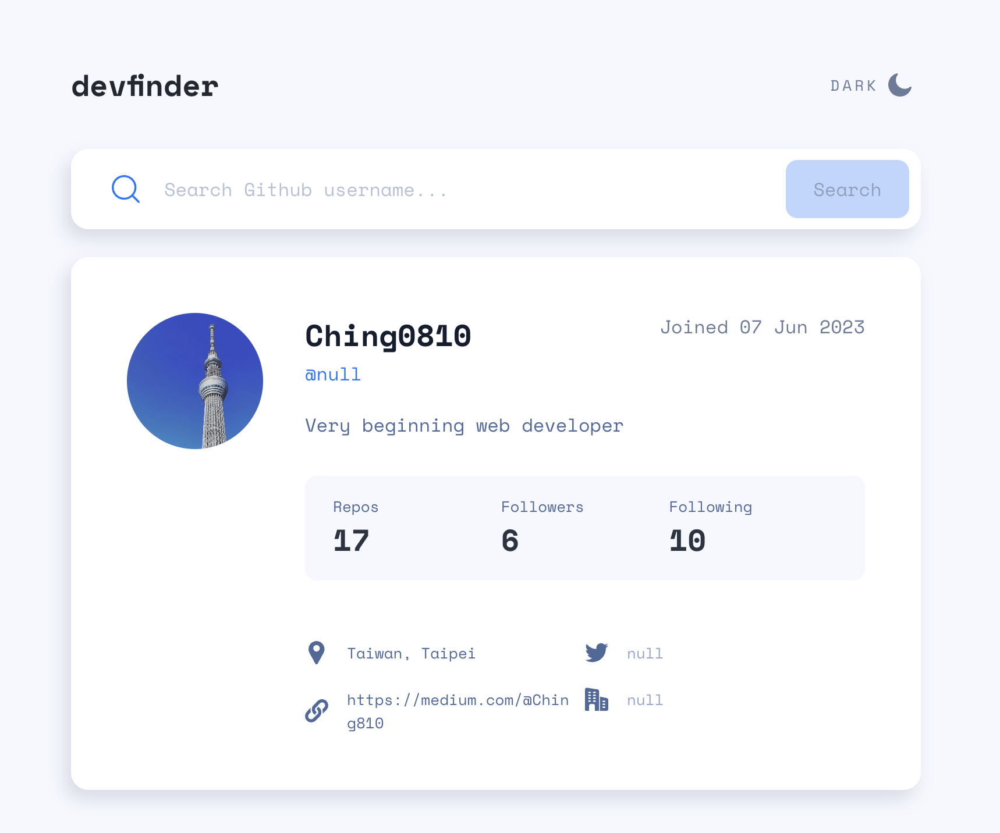
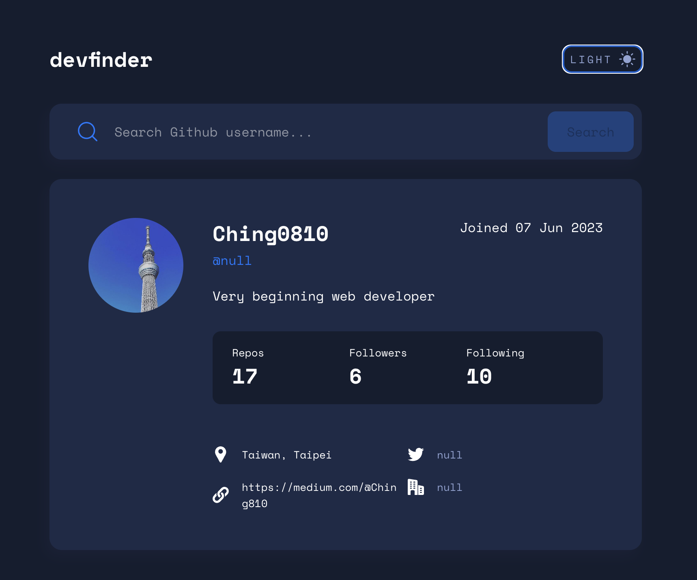
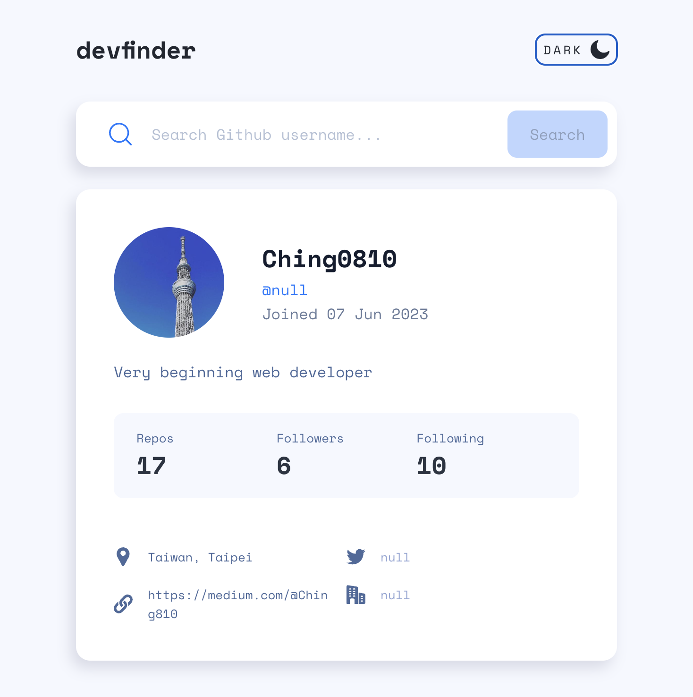
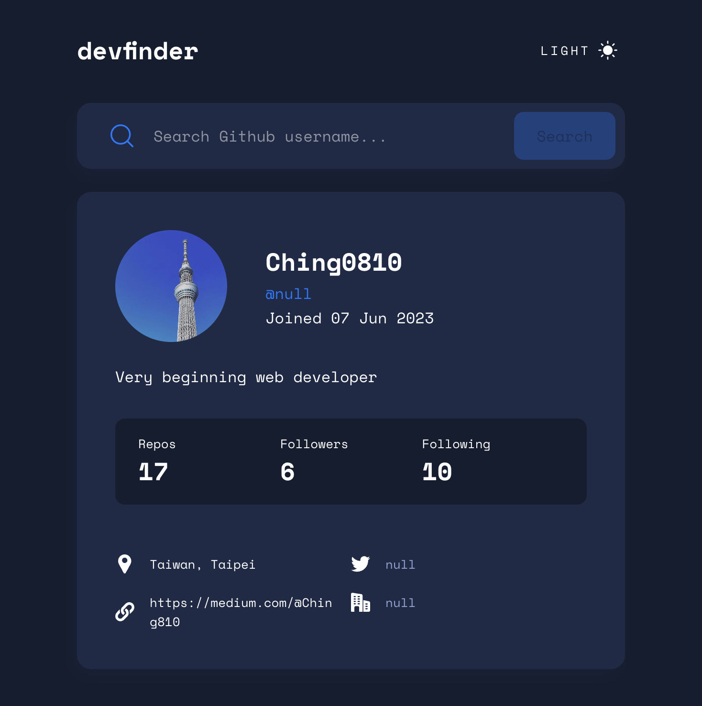
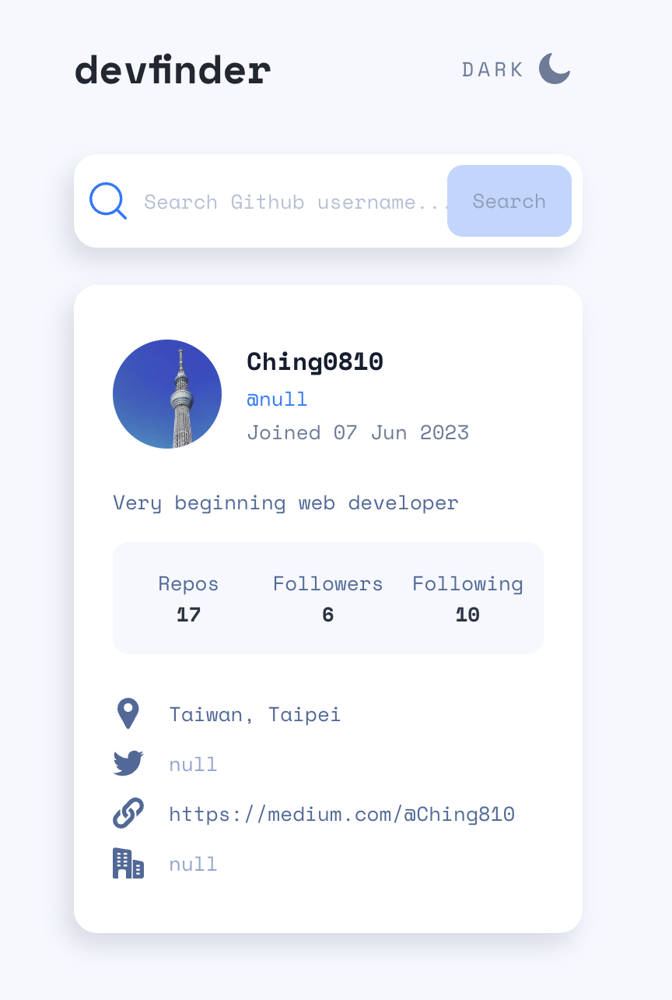
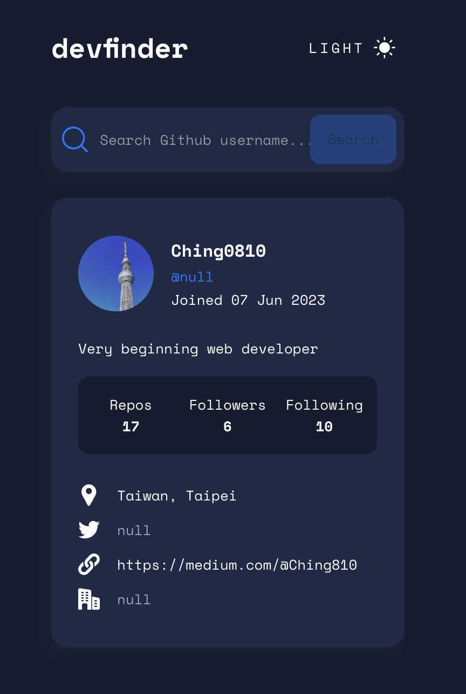

# GitHub user search app project

This is a practice project from Frontend Mentor.
</br>Personal expected skills to practice through this project:

- React useReducer hook for state management
- custom CSS with theme setting
- light & dark mode switch
- RWD setting for mobile, tablet & desktop mode
- error handling

## Table of contents

- [Overview](#overview)
  - [Feature](#feature)
  - [Screenshot](#screenshot)
  - [Links](#links)
- [My process](#my-process)
  - [Built with](#built-with)
  - [What I learned](#what-i-learned)
    - [useReducer](#usereducer-hook)
    - [custom CSS theme setting](#custom-css-theme-setting)
  - [Continued development](#continued-development)
  - [Useful resources](#useful-resources)
- [Author](#author)
- [Acknowledgments](#acknowledgments)

## Overview

### Feature

Users should be able to:

- View the optimal layout for the app depending on their device's screen size
- See hover states for all interactive elements on the page
- Search for GitHub users by their username
- See relevant user information based on their search
- Switch between light and dark themes
- Click and redirect to blog URL

### Screenshot

Desktop mode:
</br>



Tablet mode:
</br>



Mobile mode:
</br>



### Links

- Live Site URL: [https://tourmaline-licorice-f4baee.netlify.app/](https://tourmaline-licorice-f4baee.netlify.app/)

## My process

### Built with

- [React](https://reactjs.org/) - framework
- [MUI](https://mui.com/) - UI library
- CSS custom properties
- Mobile-first workflow

## What I learned

### useReducer hook

- why useReducer hook? advantages?

  - group related pieces of state into a single object: organizing and managing state more efficiently
  - handle multiple state changes in response to different actions in a more organized and maintainable way: avoids handling events separately in individual components, contributing to easier maintenance

- Syntax:

  ```javascript
  import { useReducer } from "react";
  export default function Demo() {
    const [state, dispatch] = useReducer(reducer, initialState);
    // dispatch is like setState function which could "manipulate" state
    // useReducer take 2 reqired arguement: reducer function & initial state

    return <>...</>;
  }
  ```

  1. Reducer Function:

  - Takes two arguments: the current state and an action.
  - Evaluates the action type and performs state manipulation based on the action.
  - Returns the updated state.</br>

  2. Dispatch Function:

  - Takes one argument: an action.
  - Sends the action to the reducer function for state manipulation.

  3. State Update:

  - After the reducer processes the action and updates the state, the component re-renders with the new state.

  4. Payload:

  - If additional data (payload) is needed for state manipulation, it's common to include it as part of the action object. The action object typically has a type property to indicate the action type and may include other properties like payload.

- useReducer login in this project:

  ```javascript
  import { createContext, useContext, useReducer } from "react";
  // ...

  // action: defined all possible actions
  export const actions = {
    GET_USER_INFO_SUCCESS: 'GET_USER_INFO_SUCCESS',
    GET_USER_INFO_FAIL: 'GET_USER_INFO_FAIL',
  }

  // default variable for reducer state
  // isFetchSuccess variable for determine fetch result
  const defaultUserInfo = {
    username: 'The Octocat',
    account: 'octocat',
    ...
  }

  // reducer function
  function reducer(state, action) {
    const type = action.type
    const payload = action.payload

    switch (type) {
      // when fetch success, set fetch data for render & set isFetchSuccess to true
      case actions.GET_USER_INFO_SUCCESS: {
        const newUserInfo = JSON.parse(JSON.stringify(state))
        const {
          login,
          avatar_url,
          ...
        } = payload
        newUserInfo.username = login
        newUserInfo.account = name === null? 'null': name
        ...
        return newUserInfo
      }
      // when fetch fail, set defaultUserInfoState for render & set isFetchSuccess to true
      case actions.GET_USER_INFO_FAIL: {
        const newUserInfo = JSON.parse(JSON.stringify(defaultUserInfo))
        newUserInfo.isFetchSuccess = false
        return newUserInfo
      }
      default: {
        console.log('default')
        return state
      }
    }
  }

  // context
  const UserInfoReducerContext = createContext()

  export const UserInfoProvider = ({children}) => {

    const [userInfoState, dispatch] = useReducer(reducer, defaultUserInfo)

    ...

    return (
      // only need to provide dispatch function to children components
      <UserInfoReducerContext.Provider value={{dispatch}}>
        {children}
      </UserInfoReducerContext.Provider>
    )
  }

  ...

  export const useUserInfoReducer = () => useContext(UserInfoReducerContext)
  ```

  ```javascript
  // children component
  export default function SearchInput() {
    const {dispatch} = useUserInfoReducer()

    // send both API result & event type as payload into dispatch function
    // both button onClick and Enter key down event would trigger this function
    function handleClick(e) {
      e.preventDefault()
      getUserInfo(searchName)
      .then(result => {
        if (result.status === 200) {
          dispatch({type: actions.GET_USER_INFO_SUCCESS, payload: result.data})
          setSearchName('')
        } else if (result.status === 404) {
          dispatch({type: actions.GET_USER_INFO_FAIL, payload: {}})
          console.log('Resource not found')
        }
      })
    }

    return (
      ...
      <Button
        // type="submit"
        variant="contained"
        disabled={searchName.length === 0? true: false}
        sx={{
          backgroundColor: 'common.button',
          width: isTablet?'106px':'80px',
          height: isTablet?'50px':'46px',
          fontSize: isTablet?'h3.fontSize':'h4.fontSize',
          textTransform: 'none',
          color: 'text.light',
        }}
        onClick={e=>handleClick(e)}
      >
        Search
      </Button>
      ...
    )
  }
  ```

### custom CSS theme setting

- createTheme hook & MUI default theme setting

  - theme structure & style overrides from MUI document

    ```javascript
    import { createTheme } from "@mui/material";

    const theme = createTheme({
      palette: {
        common: {
          button: '#0079FF',
          ...
        },
        text: {
          dark: '#697C9A',
          ...
        },
      },
      breakpoints: {
        values: {
          xs: 0,
          ...
        }
      },
      typography: {
        fontFamily: 'Space Mono',
        fontSize:15,
        fontWeight: 400,
        lineHeight: 25/15,
        h1: {
          fontSize: 26,
          ...
        },
        ...
      },
      components: {
        // customize Button component setting
        MuiButton: {
          styleOverrides: {
            root: {
              borderRadius: 10,
              ...
            },
          }
        },
        MuiStack: {
          styleOverrides: {
            root: {
              boxSizing: 'border-box'
              ...
            }
          }
        },
      }
    })

    export default theme
    ```

    then any component could import this theme setting through useTheme hook

## Continued development

- Component refactoring

## Useful resources

- [MUI theme setting](https://www.youtube.com/watch?v=SUEkAOuQZTQ) - tutorial for built theme setting provider for entire application
- [MUI theme setting](https://mui.com/material-ui/customization/default-theme/) - MUI documentation about default theme setting
- [useReducer hook](https://www.youtube.com/watch?v=rgp_iCVS8ys&t=61s) - tutorial for React useReducer hook syntax and concept, including simple example code

## Author

- Ching0810 - [https://github.com/Ching0810](https://github.com/Ching0810)

## Acknowledgments

Currently none
